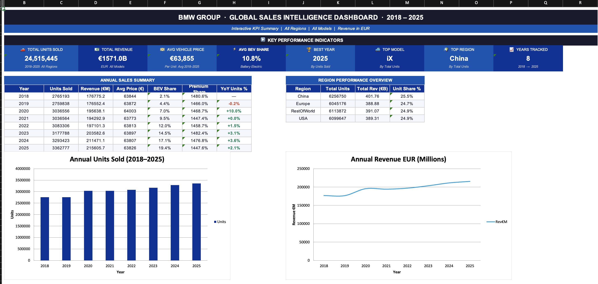

# 🚗 BMW Sales Excel Dashboard

## 📊 Project Overview
This project presents an interactive Excel dashboard analyzing BMW sales performance.  
The dashboard provides insights into revenue, cost, profit trends, and key KPIs to support data-driven decision making.

---

## 🎯 Objectives
- Analyze total sales and revenue performance
- Track cost vs profit
- Identify top-performing regions
- Visualize monthly trends
- Provide KPI-based insights for business growth

---

## 📌 Tools & Skills Used
- Microsoft Excel
- Pivot Tables
- Pivot Charts
- KPI Cards
- Slicers
- Conditional Formatting
- Data Cleaning

---

## 📈 Key Metrics Included
- Total Sales
- Total Cost
- Total Profit
- Regional Performance
- Monthly Trends
- Product Category Analysis

---

## 🖼 Dashboard Preview

---

## 💡 Insights
- Identified top-performing regions contributing highest revenue.
- Observed monthly sales trends and seasonal fluctuations.
- Compared cost vs revenue to evaluate profitability.

---

## 🚀 How To Use
1. Download the Excel file.
2. Open in Microsoft Excel.
3. Use slicers to interact with the dashboard.

---

## 👤 Author
Bipin Yadav  
Aspiring Data Analyst | Excel | SQL | Data Visualization
